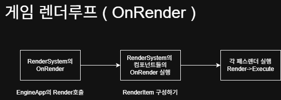

# 렌더러 구조

---



모든 SceneSystem의 등록된 `RenderComponent`의 `OnRender`를 호출.

모든 컴포넌트는 `OnRender`에서 매개변수로 받은 `RenderQueue`에  구성한 `RenderItem`을 추가한다.

### RenderItem 내용

```cpp
struct RenderItem
{
    // model
    ModelType modelType;
    const Mesh* mesh;
    Material material;
    
    // matrix
    Matrix world;       // static, rigid, skeletal
    Matrix model;       // rigid

    // skeleton
    int boneCount;
    int refBoneIndex;
    const PoseMatrixCB* poses;
    const OffsetMatrixCB* offsets;
};
```

그 후 각 렌더 패스에서 해당 `RenderItem` 데이터를 사용해  Mesh의 `Draw` 호출한다.

### GeometryPass 내용 일부

```cpp
auto& models = queue.GetRenderItems();
//...

models.mesh->Draw(context); // 메쉬 draw 호출 
// ( 내부 정점 버퍼, 인덱스 버퍼 설정 )
```